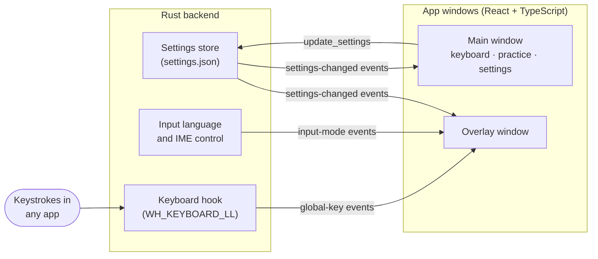

# Hangul Keys 한글 키

A Windows desktop app that teaches Korean learners to type in Hangul: a floating keyboard overlay that lights up keys as you type in any app, audio pronunciation for every letter, and adaptive typing drills.

<!-- Demo: record with ScreenToGif or ShareX, save as docs/demo.gif, then replace this comment with:
 -->

I built this while learning Korean. Reading Hangul came quickly; typing it didn't, because the Korean keyboard layout puts letters in places nothing on an English keyboard prepares you for. Hangul Keys keeps the layout in front of you while you type anywhere, and turns finding keys into practice.

## Features

**Floating keyboard overlay**
- Press **Ctrl+Alt+K** anywhere to show a see-through Korean keyboard on top of any app.
- Keys light up in real time as you type in your browser, Discord, Word, or any other app.
- Switches the app you're typing in to the Windows Korean keyboard (in 가 mode) when it opens, and restores your previous input language when it closes. A 한 / A badge shows the current mode.
- Never takes keyboard focus, and clicks pass through it to the app underneath; only its toolbar is clickable.
- Drag to move, collapse the toolbar, and adjust size and transparency. It remembers where you left it.

**Pronunciation**
- Click any letter to hear its sound, its name (ㄱ is 기역), and an example word (가방, *bag*).
- Tips for sounds English speakers find tricky, like ㄹ, ㅓ, and the tense consonants ㄲ ㄸ ㅃ.

**Typing practice**
- **Letter drill:** press the key for each letter shown. It adapts to you: letters you miss or find slowly come up more often.
- **Listening drill:** hear a letter and find its key without seeing it.
- **Word typing:** type 61 everyday words and phrases, watching each syllable build as you type (ㅎ → 하 → 한).
- Results show keys per minute, accuracy, and the letters to work on, and your weakest letters are tracked across sessions.

**Main app**
- A full on-screen keyboard showing each key's English letter, Korean letter, and romanization, with consonants and vowels color-coded.
- A typing area that composes Hangul syllables as you type, with no Windows Korean keyboard required.
- Runs in the system tray, so the overlay and hotkey keep working after the window is closed.

## Getting started

### Requirements
- Windows 10 or 11
- The Windows Korean keyboard, for typing Korean in other apps: **Settings → Time & language → Language & region → Add a language → Korean**. Its text-to-speech voice is used for pronunciation. The app tells you if either is missing.

### Run from source
You'll need [Node.js](https://nodejs.org/) 20+, [Rust](https://rustup.rs/) (the default MSVC toolchain), and the [Tauri prerequisites for Windows](https://tauri.app/start/prerequisites/) (Microsoft C++ Build Tools and WebView2).

```bash
git clone https://github.com/JonathanYJJoh/hangul-keys.git
cd hangul-keys
npm install
npm run tauri dev
```

To build an installer, run `npm run tauri build`. The installer is written to `src-tauri/target/release/bundle/`.

## Usage

| Action | How |
|---|---|
| Show or hide the floating keyboard | **Ctrl+Alt+K**, or the tray icon menu |
| Move the overlay | Drag the ⠿ grip on its toolbar |
| Toggle Korean (한) / English (A) | Click the badge on the overlay, or press the 한/영 key (Right Alt) |
| Hear a letter | Click its key on the **Keyboard** page |
| Practice | Open the **Practice** tab and pick a drill; **Esc** quits a drill |
| Quit completely | Right-click the tray icon → **Quit** (closing the window keeps it running in the tray) |

## How it works

Hangul Keys is a [Tauri](https://tauri.app/) app: the interface is React and TypeScript, and a small Rust backend does what a web page can't, like watching the keyboard system-wide and controlling Windows input settings.



### Hangul composition
Korean letters (jamo) stack into syllable blocks: ㅎ + ㅏ + ㄴ becomes 한. The composition engine ([`src/hangul/composer.ts`](src/hangul/composer.ts)) is a state machine that decides, after each keystroke, whether the letter joins the current block or starts a new one. That covers compound vowels (ㅗ + ㅏ → ㅘ), double final consonants (ㄹ + ㄱ → ㄺ), and the rule that trips up learners: a final consonant moves to the next block when a vowel follows (한 + ㅏ → 하나). Backspace undoes one keystroke at a time rather than a whole syllable.

Characters are computed from Unicode's ordering of the 11,172 precomposed syllables:

```
syllable = 0xAC00 + (initial × 21 + vowel) × 28 + final
```

The reverse, `decompose()`, tells the typing drills exactly which keys a word takes. A test takes every one of the 11,172 syllables apart and checks that composing it gives back the original.

### System-wide key highlighting
The overlay never has keyboard focus, so it can't receive key events the normal way. Instead, [`keyhook.rs`](src-tauri/src/keyhook.rs) installs a Windows low-level keyboard hook on a dedicated thread. It maps each key's **scan code** (its physical position) to a key name, so the key labeled Q always means ㅂ, whatever the active layout. The hook passes events to another thread through a channel and returns immediately, because Windows waits on it before delivering each keystroke.

### Switching to Korean
Windows tracks two things separately: which keyboard language a window uses, and whether the Korean keyboard is typing Hangul (가) or Latin letters (A). [`input_lang.rs`](src-tauri/src/input_lang.rs) handles both: it sends `WM_INPUTLANGCHANGEREQUEST` to switch the active app's language, and talks to that window's IME with `WM_IME_CONTROL` to read or set Hangul mode. It remembers exactly what it changed, so closing the overlay restores your previous setup.

### A partly click-through window
Windows can make a whole window click-through, but not part of one. So the overlay page reports where its toolbar is, and a Rust thread checks the cursor position about 30 times a second, turning click-through off only while the mouse is over the toolbar.

### Adaptive drills
Each letter gets a weakness score from its smoothed miss rate and how long you take to find it ([`src/practice/stats.ts`](src/practice/stats.ts)). Drills pick letters at random with probability proportional to weakness, never repeating a letter twice in a row, so practice concentrates on what you find hard without ignoring new letters.

## Privacy
Key highlighting reads keystrokes system-wide, so it's designed to be minimal:
- Keys are only forwarded while the overlay is visible, and only as key names (like `KeyQ`).
- Nothing is logged, saved, or sent anywhere. The app makes no network requests.
- You can turn highlighting off in **Settings**.

Windows doesn't let normal apps observe or change apps running as administrator, so highlighting and the Korean switch don't apply there.

## Development

```bash
npm test               # TypeScript tests (Vitest)
cd src-tauri && cargo test   # Rust tests
npm run tauri dev      # run the app with hot reload
```

There are 142 TypeScript tests covering the composition engine, decomposition (including every Hangul syllable), the pronunciation data, the word list, and drill and scoring logic, plus Rust tests for scan-code mapping and settings validation.

### Project layout
```
src/
  hangul/       composition engine, jamo tables, pronunciation data
  keyboard/     the Dubeolsik (두벌식) keyboard layout
  practice/     drill rules, adaptive letter picking, word list, saved progress
  pages/        Keyboard, Practice, and Settings pages
  components/   on-screen keyboard and letter detail panel
  overlay.tsx   the floating keyboard window
src-tauri/src/
  overlay.rs    overlay window, placement, click-through toolbar
  keyhook.rs    system-wide keyboard hook
  input_lang.rs Windows input language and IME control
  settings.rs   settings shared by both windows, saved to disk
  tray.rs       system tray icon and menu
```

## Built with
[Tauri 2](https://tauri.app/) · [Rust](https://www.rust-lang.org/) · [React](https://react.dev/) · [TypeScript](https://www.typescriptlang.org/) · [Vite](https://vite.dev/) · [Vitest](https://vitest.dev/) · [windows-rs](https://github.com/microsoft/windows-rs)
